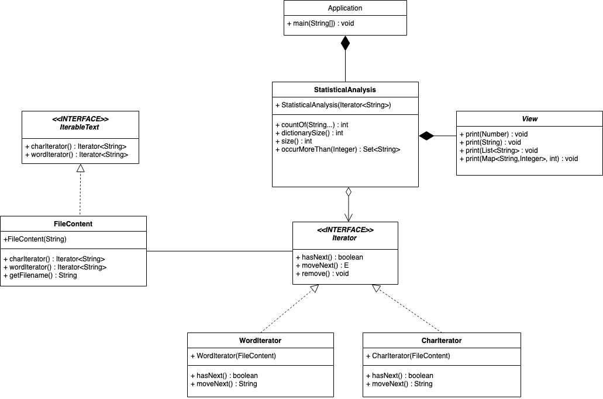
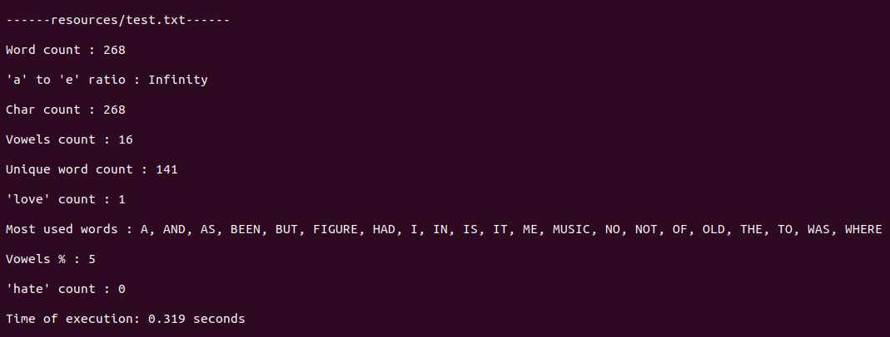

# Java exercise 4 - Text Analyser

Java exercise aiming at proper implementation of given UML diagram, with emphasis on using packages, appropriate access modifiers and first time implementing interfaces.

The program itself was created to analyse big amounts of texts in terms of used words, characters and statistic connected to these issues. However, the program's execution was a secondary focus in this assignment, since the most important was to use classes in accordance to all OOP principles.

## UML class diagram

On the contrary to other assignments, this time the task was to properly understand and implement the class diagram creates by school's mentors:

## Program's planned output

`---text1.tx--- `    name of the analyzed file -->

`Char count: 761674`  number of characters in the file (without white-spaces)

`Word count: 188912`  number of words in the file

`Dict size: 10762`  dictionary size: number of different words used

`Most used words (>1%): [a,and,had..<more>]` all words that make up for more than 1% of the text

`'love' count: 60` number of times that the word ‘love’ occurred -->

`'hate' count: 4` number of times that the word ‘hate’ occurred**

`'music' count: 4` number of times that the word ‘music’ occurred -->

`vowels %: 38` what part of all characters are vowels (a,o,i,e,u)

`a:e count ratio: 1.54 ` the ratio of ‘a’ to ‘e’ occurrences

## View of the program's execution
Application allows the user to pass paths to text files for analysis as CLI arguments. Also, measure  the time of the program's execution. For example:

>  _java Application text1.txt text2.txt_

Screenshot of the program's output:

## Technologies
* Java SE 13
* Testing framework - JUnit 4

## Lessons learned from the assignment
* implementing class structure created by someone else
* using different access modifiers
* using packages
* implementing two interfaces
* first approach to unit testing (+ making fake class to test single method)

## Status
Project is finished.

## Credits
Project assigned and supervised by Codecool mentors.
